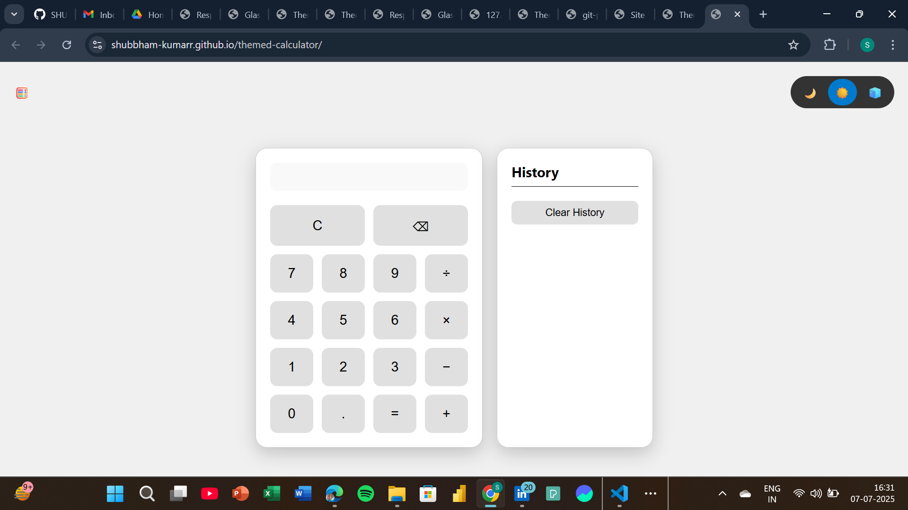
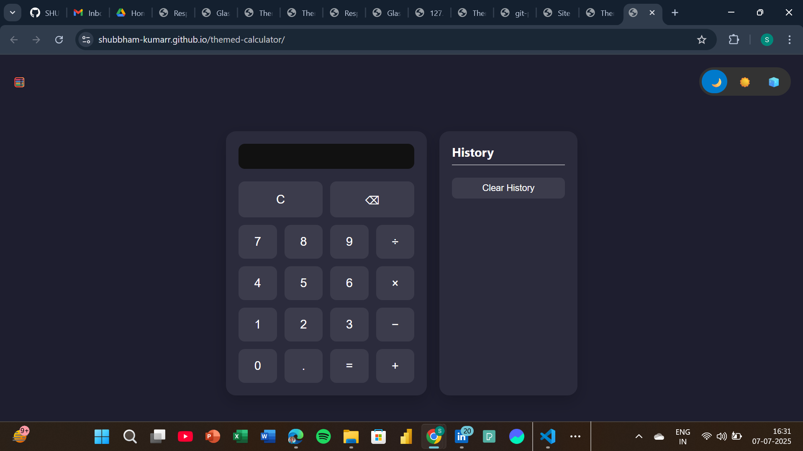
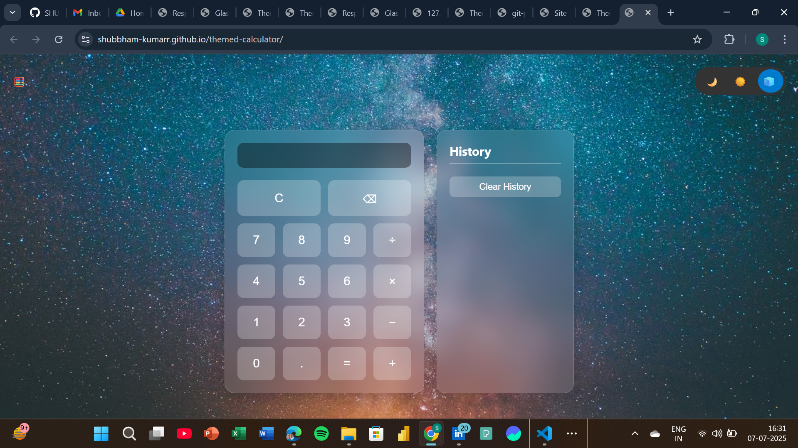

# 🧮 Themed Calculator

A stylish, multi-theme calculator built with **HTML**, **CSS**, and **JavaScript**. It supports basic arithmetic, live preview, keyboard input, history tracking, and elegant theme switching between:

- 🌙 Dark Mode
-☀️ Regular (Light) Mode
- 🧊 Glassmorphic Mode

---

## 🚀 Live Demo

🔗 [View it on GitHub Pages](https://SHUBBHAM-KUMARR.github.io/themed-calculator/)

---

## ✨ Features

- 🖩 Basic Operations: `+`, `−`, `×`, `÷`, `.`
- ⌨️ Keyboard Support: Enter numbers and operations using your keyboard
- 🔁 Real-Time Preview: Displays result as you type
- 📜 Calculation History: Saved in `localStorage` and persists across sessions
- 🎨 Theme Switcher: Toggle between 3 unique visual styles
- ✅ Responsive Design: Optimized for desktop and mobile devices

---

## 🧰 Tech Stack

- **HTML5**
- **CSS3**
- **Vanilla JavaScript**
- **[Math.js](https://mathjs.org/)** for accurate expression evaluation

---
## Preview

  
  
  
---
## 📂 Folder Structure
> **themed-calculator/**
**|**
**|--index.html**
**|---style.css**
**|---script.js**
 
